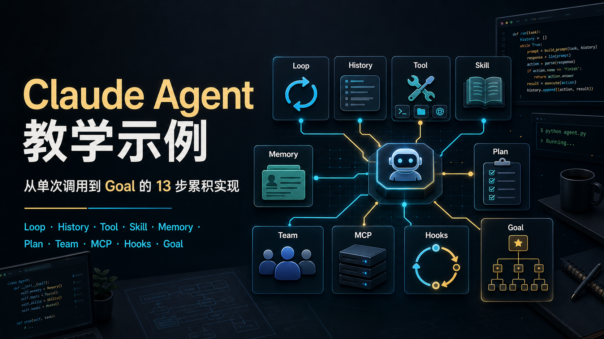

# Claude Agent 教学示例

用 Python 从零构建 AI Agent。项目核心是 [build-agent-example/](build-agent-example/)：从一次模型调用开始，后续每一步都保留前一步的全部代码和能力，逐步加入循环、history、system prompt、工具、skills、memory、规划、子代理、团队协作、MCP、hooks 和 goal。

配套资料包括 [ppt/](ppt/) 讲解页、[bilibili-transcripts/](bilibili-transcripts/) 视频转写稿，以及 `skills/`、`memory/`、`templates/` 演示资源。

---

## 快速开始

```bash
python -m venv .venv
source .venv/bin/activate                 # Windows: .venv\Scripts\activate
pip install -r requirements.txt

cp .env.example .env                      # 填入 ANTHROPIC_API_KEY / ANTHROPIC_MODEL

python build-agent-example/code/step01_single_call.py
```

## 目录结构

```text
build-agent-example/
├── code/                  step01-step13 教学代码
├── doc/                   step01-step13 同名讲解文档，统一教学结构
└── mcp_server_time.py     step11 MCP 本地 time server

skills/                    skill 演示资源，供 step06+ 读取
memory/                    memory 演示存储，供 step07+ 读取/写入
templates/                 USER.md 与 compact_prompt.md 等记忆模板
mcp_servers.json           step11 MCP server 配置，默认使用 .venv/bin/python
ppt/                       课程 HTML/PPT 资料
bilibili-transcripts/      前七期视频的带时间戳纠错转写稿
assets/readme/             README 封面和图片资源
```

根目录不再保留完整 `agent/` 运行时；教学代码保持单文件可读。`skills/`、`memory/`、`templates/` 是演示资源，不删除。

## 教学主线

`build-agent-example/code/step01` 到 `step13` 采用严格累积写法：后一步保留前一步的全部核心代码和能力，只在此基础上新增一个主题能力。也就是说，`step11 = step10 + MCP`，`step12 = step11 + Hooks`，`step13 = step12 + Goal`。

`build-agent-example/doc/step01` 到 `step13` 采用统一结构：问题、解决方案、工作原理、变更内容、试一试，便于按期阅读和录课。

| 步骤 | 代码 | 文档 | 能力 | 新增概念 |
|------|------|------|------|----------|
| 1 | [step01_single_call.py](build-agent-example/code/step01_single_call.py) | [doc](build-agent-example/doc/step01_single_call.md) | 单次对话 | API 调用基础 |
| 2 | [step02_loop_no_memory.py](build-agent-example/code/step02_loop_no_memory.py) | [doc](build-agent-example/doc/step02_loop_no_memory.md) | 连续对话 | 循环交互，无记忆 |
| 3 | [step03_history.py](build-agent-example/code/step03_history.py) | [doc](build-agent-example/doc/step03_history.md) | 短期记忆 | `messages[]` history 回灌 |
| 4 | [step04_system_prompt.py](build-agent-example/code/step04_system_prompt.py) | [doc](build-agent-example/doc/step04_system_prompt.md) | 角色设定 | system prompt |
| 5 | [step05_tool_use.py](build-agent-example/code/step05_tool_use.py) | [doc](build-agent-example/doc/step05_tool_use.md) | Tool Use | 工具调用循环 |
| 6 | [step06_skills.py](build-agent-example/code/step06_skills.py) | [doc](build-agent-example/doc/step06_skills.md) | Skills | 按需加载 `skills/{name}/SKILL.md` |
| 7 | [step07_memory_system.py](build-agent-example/code/step07_memory_system.py) | [doc](build-agent-example/doc/step07_memory_system.md) | 记忆系统 | raw history、长期记忆、用户画像、compact |
| 8 | [step08_plan_todolist.py](build-agent-example/code/step08_plan_todolist.py) | [doc](build-agent-example/doc/step08_plan_todolist.md) | 任务规划 | `update_todos` todolist |
| 9 | [step09_subagent.py](build-agent-example/code/step09_subagent.py) | [doc](build-agent-example/doc/step09_subagent.md) | 子代理 | 独立上下文 + 多身份 + 并发派遣 |
| 10 | [step10_agent_team.py](build-agent-example/code/step10_agent_team.py) | [doc](build-agent-example/doc/step10_agent_team.md) | Agent Team | 持久队友 + inbox + team 状态 |
| 11 | [step11_mcp.py](build-agent-example/code/step11_mcp.py) | [doc](build-agent-example/doc/step11_mcp.md) | MCP | 外部工具服务器 + stdio transport |
| 12 | [step12_hooks.py](build-agent-example/code/step12_hooks.py) | [doc](build-agent-example/doc/step12_hooks.md) | Hooks | Before/After 拦截、改写、审计 |
| 13 | [step13_goal.py](build-agent-example/code/step13_goal.py) | [doc](build-agent-example/doc/step13_goal.md) | Goal | 目标树 + 自主循环 + 完成判定 |
| 附录 | [sp_mcp-skill-tool.py](build-agent-example/code/sp_mcp-skill-tool.py) | [doc](build-agent-example/doc/sp_mcp-skill-tool.md) | MCP × Skill × Tool | MCP 接单、Skill 加载 SOP、Tool 执行 |

## 记忆资源

step07 以后会读取并写入这些文件：

| 文件 | 作用 |
|------|------|
| `memory/history.jsonl` | 原始对话流水 |
| `memory/YYYY-MM-DD.md` | 情景记忆 |
| `memory/MEMORY.md` | 长期核心记忆，每轮注入 prompt |
| `templates/USER.md` | 用户画像和稳定偏好 |
| `templates/agent/compact_prompt.md` | 压缩旧对话的提示词模板 |

代码只在文件缺失时创建默认内容，不会覆盖已有记忆。

## Skills 系统

`skills/{name}/SKILL.md` 用 YAML frontmatter 描述触发条件，Markdown 写知识内容。Agent 在需要时通过 `load_skill` 工具按需加载，避免把所有知识一次性塞进 system prompt。

当前内置技能包括 `clawhub`、`ddg-web-search`、`github`、`red-braised-pork`、`skill-creator`、`summarize`、`weather`。

## 配套 PPT

- [第一期：什么是 agent](ppt/第一期-什么是agent.html)
- [第二期：手搓 agent](ppt/第二期-手搓agent.html)
- [第三期：记忆系统](ppt/第三期-记忆系统.html)
- [第四期：Agent 任务规划](ppt/第四期-agent任务规划.html)
- [第五期：Agent 子代理的实现](ppt/第五期-agent子代理的实现.html)
- [第六期：Agent Team 团队协作](ppt/第六期-agent团队协作.html)
- [第七期：Tool / Skill / MCP 三者辨析](ppt/第七期-tool-skill-mcp.html)
- [第八期：Hooks 生命周期](ppt/第八期-hooks生命周期.html)
- [第九期：目标驱动 Agent](ppt/第九期-目标驱动agent.html)

## 视频转写稿

前七期 B 站视频已转写为带时间戳的纠错文本，按期单独保存：

- [第一期：什么是 Agent](bilibili-transcripts/01-什么是Agent.txt)
- [第二期：百行代码从零手搓 Agent](bilibili-transcripts/02-百行代码从零手搓Agent.txt)
- [第三期：个人 Agent 记忆系统的实现](bilibili-transcripts/03-个人Agent记忆系统的实现.txt)
- [第四期：Agent 的任务规划](bilibili-transcripts/04-Agent的任务规划.txt)
- [第五期：子代理实现](bilibili-transcripts/05-子代理实现.txt)
- [第六期：Agent Team 团队协作](bilibili-transcripts/06-Agent-Team团队协作.txt)
- [第七期：MCP、Skill、Tool](bilibili-transcripts/07-MCP-Skill-Tool.txt)
