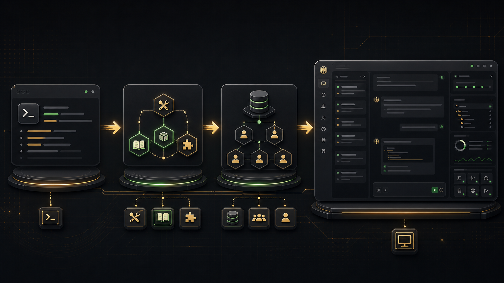
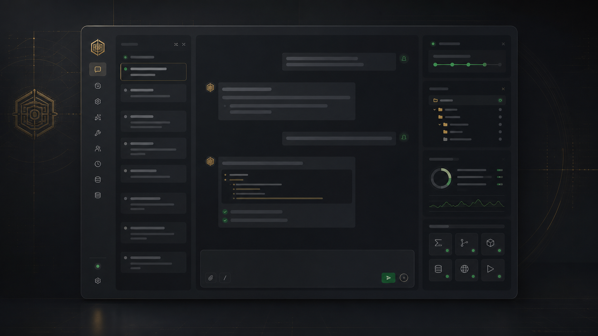
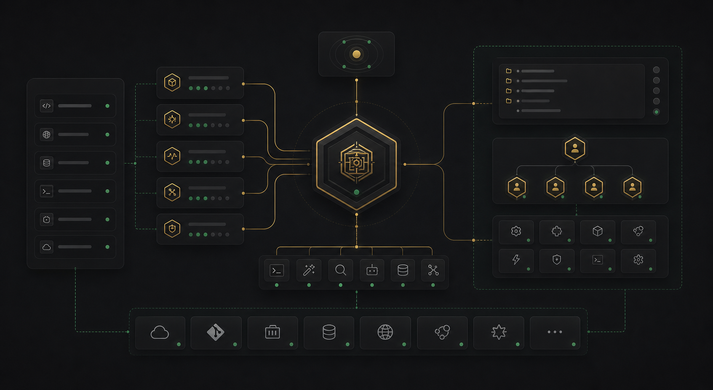

# Claude Agent 示例

用 Python 从零构建 AI Agent。包含两部分：

1. **`agent/`** — 一个完整可用的多轮对话 Agent，带三层记忆系统、自动压缩、可插拔技能、任务规划、子代理派遣、Agent Team 固定班底与 **MCP 外部工具接入**。
2. **[build-agent-example/](build-agent-example/)** — 渐进式教学示例（step01 → step10），从单次对话到 Tool Use + Skills + Todolist + Subagent + Agent Team + **MCP**。每个示例都配有同名讲解文档。

配套讲解 PPT 见 [ppt/](ppt/)。

<p align="center">
  
</p>

---

## 进阶项目推荐：Emperor Agent

如果你已经理解本仓库教学示例的核心原理，可以继续看一个更完整的产品化形态。Emperor Agent 不是替代本仓库 step01 → step10 的入门路径，而是回答下一个问题：这些机制落到一个长期可用的本地产品里，会长成什么样。

[TheSyart/emperor-agent](https://github.com/TheSyart/emperor-agent) — 一个本地运行的皇帝风格 AI Agent，带 Vue WebUI、多模型提供商、流式聊天、工具、Skills、记忆系统和 token 用量统计。

<p align="center">
  
</p>

它适合作为本仓库的进阶展示：从命令行教学示例进阶到 Electron + Vue 桌面工作台，从单一 Claude API 调用进阶到多模型提供商接入，从基础工具调用进阶到工具、Skills、MCP、记忆、Scheduler、权限控制和 telemetry 的完整组合。

| 本仓库先学会 | Emperor Agent 里的产品化形态 |
|---|---|
| `messages.create` 与多轮历史 | Chat / Build 多会话，按 session 保存历史、checkpoint 和运行事件 |
| Tool Use + Skills + MCP | 内置工具、按需技能加载、stdio / SSE MCP 外部工具统一调度 |
| 三层记忆与自动 compact | Chat 写全局长期记忆，Build 写项目 `AGENTS.md` 托管记忆区块 |
| 子代理与 Agent Team | Build 项目级内部 Team，子任务独立上下文执行，结果摘要回填 |
| token 统计与上下文治理 | 多 provider / model 维度统计，工具结果截断与旧结果摘要化 |
| 任务规划与长期任务 | Ask / Plan 权限流、Scheduler、Watchlist heartbeat 和主动 turn |

<p align="center">
  
</p>

推荐阅读顺序：

1. 先看 `desktop/`：理解 Electron + Vue 如何把本地 Agent 包成桌面工作台。
2. 再看 `agent/sessions/`、`agent/runtime/`：理解多会话、流式事件和中断恢复。
3. 接着看 `agent/memory.py`、`agent/projects/`：对照本仓库的三层记忆，理解 Chat / Build 的记忆分流。
4. 然后看 `agent/mcp/` 和 `agent/tools/`：理解 MCP、内置工具、Skills 如何进入统一调度层。
5. 最后看 `agent/control/`、`agent/permissions/`、`agent/scheduler/`、`agent/team/`：理解 Plan/Ask 权限、长期任务和项目级 Team 如何支撑真实工作流。

---

## 快速开始

```bash
python -m venv .venv
source .venv/bin/activate                 # Windows: .venv\Scripts\activate
pip install -r requirements.txt

cp .env.example .env                      # 填入 ANTHROPIC_API_KEY

python agent.py                                        # 启动主 Agent
# —— 或 ——
python build-agent-example/code/step01_single_call.py  # 从最简单的教学示例开始
```

## 主 Agent（`agent.py` + `agent/` 包）

启动后是一个"大内总管 / 皇上"角色的命令行对话循环。皇上下旨，总管调度工具、分发小太监、把差事办妥后回禀。

### 目录结构

```
agent.py                    入口（4 行）
agent/
├── loop.py                 主循环 + 全部组件装配
├── runner.py               单轮 messages.create + tool_use 循环 + 安全工具并发
├── memory.py               三层记忆存储
├── compactor.py            历史压缩 → 情景记忆 + MEMORY.md
├── context.py              system prompt 组装（Jinja2）
├── skills.py               技能加载器
├── team.py                 Agent Team：文件 inbox + 队友状态 + 持久线程
├── telemetry.py            token 用量记录与压缩触发判断
├── subagents/              子代理 spec + registry（从模板加载身份）
└── tools/                  内置工具 + MCP 接入
    ├── shell / web / filesystem / search / skills
    ├── mcp/                MCP 客户端、工具包装、配置读取
    ├── todo.py             update_todos —— 任务规划 todolist
    ├── dispatch.py         dispatch_subagent —— 派遣子代理（支持并发）
    └── team.py             spawn/list/send/read/broadcast —— 固定队友协作

templates/
├── SOUL.md                 Agent 灵魂档案（人格 / 使命 / 边界，只读）
├── USER.md                 用户偏好档案（压缩时按信号更新）
├── agent/
│   ├── identity.md         工作区路径声明（Jinja2 模板）
│   ├── skills_section.md   技能清单注入
│   └── compact_prompt.md   压缩 LLM 的提示词
└── subagents/              子代理身份模板
    ├── xiaohuangmen.md     通传小黄门（轻量只读）
    ├── sili_suitang.md     司礼监随堂小太监（只读文书）
    ├── dongchang_tanshi.md 东厂探事小太监（只读查访）
    ├── shangbao_dianbu.md  尚宝监典簿小太监（只读核验）
    ├── neiguan_yingzao.md  内官监营造小太监（可读写、可执行命令）
    ├── general.md          旧模板保留；运行时别名指向 neiguan_yingzao
    └── researcher.md       旧模板保留；运行时别名指向 dongchang_tanshi

mcp_servers.json              MCP Server 配置（命令、参数、启用开关）

memory/                     运行期产物（已 gitignore）
├── MEMORY.md               长期记忆，每轮注入 system prompt
├── history.jsonl           原始对话日志
├── tokens.jsonl            按调用记录 token 用量
└── YYYY-MM-DD.md           每日情景记忆，压缩时生成

.team/                      运行期团队状态（已 gitignore）
├── config.json             队友 name / role / status
└── inbox/*.jsonl           每个成员一个文件收件箱

skills/                     可插拔技能包
└── {name}/SKILL.md         技能描述（YAML frontmatter + Markdown）
```

### 三层记忆系统

| 层 | 载体 | 何时写 | 何时读 |
|----|------|--------|--------|
| 工作记忆 | `history` 列表（内存） | 每轮追加 | 全量传给 LLM |
| 情景记忆 | `memory/YYYY-MM-DD.md` | 压缩触发时 | 按需 grep |
| 长期记忆 | `memory/MEMORY.md` | 压缩 / 启动归档时 | 每轮注入 system prompt |

**自动压缩**：上一次调用的 input_tokens 超过 `200_000 × 0.7 = 140K` 时，把 `history[:-10]` 喂给 LLM 提炼成情景段落 + 更新 MEMORY.md，只保留最近 10 轮。

**启动归档**：上次会话未达压缩阈值就退出 → 通过 `history.jsonl` 中的 `compact_event` 标记，启动时把未归档对话补归档，跨会话不丢上下文。

### 内置工具

| 工具 | 说明 |
|------|------|
| `run_command` | 执行 shell 命令 |
| `web_fetch` | 抓取 URL |
| `read_file` / `write_file` / `edit_file` | 工作区文件读写 |
| `glob` / `grep` | 工作区搜索 |
| `load_skill` | 按需加载 `skills/{name}/SKILL.md` 进上下文 |
| `update_todos` | 维护当前差事的 todolist（同时只允许一个 in_progress） |
| `dispatch_subagent` | 派遣预设身份的小太监独立办差，仅回传一段总结 |
| `spawn_teammate` / `list_teammates` | 召入固定队友，并查看团队状态 |
| `send_message` / `read_inbox` / `broadcast` | 通过 `.team/inbox/*.jsonl` 给队友发信、读回禀或广播 |
| `list_mcp_servers` / `mcp_*` | 查看已连接 MCP Server；调用其暴露的工具 |

### 任务规划：todolist

`update_todos` 工具维护一份跨用户回合存活的待办列表。每次传入完整数组（全量覆盖），状态在 `pending / in_progress / completed` 间流转，约束同一时间至多一个任务为 `in_progress`。Todo 不进入 `history`，压缩时不会丢失。

### 子代理派遣：dispatch_subagent

子代理拥有**独立的 history**：跑工具、试错、读多个文件都发生在子上下文中，最后只回传一段文字总结，主 history 只多一条 `tool_result`。适合：抓取并阅读多个网页、批量执行命令并整理输出、跨多文件查找。

身份定义在 `templates/subagents/{name}.md`（只写身份/口吻/职责）+ `agent/subagents/registry.py`（写工具白名单和 `max_turns`，安全设置不放模板）。当前内置：

- `xiaohuangmen` — 通传小黄门，轻量只读，适合短命令、快速确认、跑腿探路。
- `sili_suitang` — 司礼监随堂小太监，只读文书，适合阅读代码、查阅文档、整理提纲。
- `dongchang_tanshi` — 东厂探事小太监，只读查访，适合抓网页、查资料、探索性搜索。
- `shangbao_dianbu` — 尚宝监典簿小太监，只读核验，适合盘点文件、校对清单、检查遗漏。
- `neiguan_yingzao` — 内官监营造小太监，可读写可执行命令，适合修改文件、搭建工程、跑命令验收。

`researcher` / `general` 作为旧别名继续兼容，分别映射到 `dongchang_tanshi` / `neiguan_yingzao`。多件互不依赖的子任务可在同一轮发出多个 `dispatch_subagent`，运行时会并发派遣并按原 tool_use 顺序回填结果。

子代理**不能再派遣其他子代理**（`dispatch_subagent` 不在白名单内，防递归），也**不能写主 agent 的 todolist**。

#### 并发派遣触发条件

并发能力落在 `AgentRunner` 的工具执行层：同一轮模型回复中，连续出现多个 `concurrency_safe` 工具调用时，runner 会用 `ThreadPoolExecutor` 并行执行，再按原始 `tool_use` 顺序回填 `tool_result`。`dispatch_subagent` 标记为并发安全，因为每次派遣都有独立的 history、registry 和 runner。

也就是说，并发不是一个单独命令，而是这个形态：

```text
assistant tool_use:
  - dispatch_subagent(agent_type="shangbao_dianbu", task="清点 step01 ...")
  - dispatch_subagent(agent_type="shangbao_dianbu", task="清点 step02 ...")
  - dispatch_subagent(agent_type="shangbao_dianbu", task="清点 step03 ...")
```

运行时会看到类似：

```text
[并发执行 3 个工具]: dispatch_subagent, dispatch_subagent, dispatch_subagent
```

注意：这是**模型调度触发**的能力。如果某个任务可以用一条普通命令高效完成，例如 `wc -l a.py b.py c.py`，模型可能直接调用 `run_command`，不会强制派子代理。要稳定触发并发派遣，可以在指令里明确说“分别派三个小太监 / 并发统计 / 每个文件单独派人”。

### Agent Team 固定班底

Agent Team 面向长期项目和固定角色协作。主 Agent 可用 `spawn_teammate(name, role, prompt)` 召入队友；队友拥有独立线程、独立上下文和自己的 inbox。办完当前任务后，队友不会销毁，而是回到 `idle` 等下一封消息。

运行期状态写在根目录 `.team/`：

```text
.team/
├── config.json
└── inbox/
    ├── lead.jsonl
    ├── alice.jsonl
    └── reviewer.jsonl
```

`MessageBus` 的规则很简单：发送消息就是向目标 `{name}.jsonl` 追加一行 JSON；读取 inbox 就是读出所有消息后清空文件。支持的消息类型包括 `message / broadcast / shutdown_request / shutdown_response / plan_approval_response`。

队友状态：

- `working / idle`：当前进程里的队友线程还活着。
- `offline`：`.team/config.json` 里有这个队友，但程序重启后旧线程已经消失；需要再次 `spawn_teammate` 唤回。
- `shutdown`：队友已主动退出。

固定队友的工具白名单包含基础工具和通信工具：`run_command / web_fetch / load_skill / read_file / write_file / glob / grep / send_message / read_inbox`。不包含 `dispatch_subagent` 和 `update_todos`，避免递归调度和污染主计划。

CLI 快捷命令：

- `/team`：查看团队成员状态。
- `/inbox`：读取并清空 lead 的 inbox。

### MCP 外部工具接入

主 Agent 支持通过 [Model Context Protocol](https://modelcontextprotocol.io/) 接入外部工具 Server。配置写在项目根目录 `mcp_servers.json`，启动时会自动连接每个 enabled server，把其工具注册为 `mcp_{server}_{tool}` 形式的本地工具。

示例配置：

```json
{
  "servers": {
    "time": {
      "enabled": true,
      "command": "python",
      "args": ["build-agent-example/mcp_server_time.py"]
    }
  }
}
```

- `mcp_*` 工具默认 `read_only=True`，会被并发执行；
- system prompt 会自动注入当前可用的 MCP Server 工具清单；
- 不确定时可调用 `list_mcp_servers` 查看已连接 server 及其工具。

MCP 客户端的同步封装位于 `agent/tools/mcp/client.py`：后台线程运行 asyncio event loop，主线程通过 `run_coroutine_threadsafe()` 调用 `list_tools` / `call_tool`。

---

## 教学示例 [build-agent-example/](build-agent-example/)

`code/` 放代码，`doc/` 放同名讲解文档。

| 步骤 | 代码 | 文档 | 能力 | 新增概念 |
|------|------|------|------|----------|
| 1 | [step01_single_call.py](build-agent-example/code/step01_single_call.py) | [doc](build-agent-example/doc/step01_single_call.md) | 单次对话 | API 调用基础 |
| 2 | [step02_loop_no_memory.py](build-agent-example/code/step02_loop_no_memory.py) | [doc](build-agent-example/doc/step02_loop_no_memory.md) | 连续对话 | 循环交互 |
| 3 | [step03_history.py](build-agent-example/code/step03_history.py) | [doc](build-agent-example/doc/step03_history.md) | 多轮记忆 | `messages[]` 历史 |
| 4 | [step04_system_prompt.py](build-agent-example/code/step04_system_prompt.py) | [doc](build-agent-example/doc/step04_system_prompt.md) | 角色设定 | system prompt |
| 5 | [step05_tool_use.py](build-agent-example/code/step05_tool_use.py) | [doc](build-agent-example/doc/step05_tool_use.md) | Tool Use | 工具调用循环 |
| 6 | [step06_skills.py](build-agent-example/code/step06_skills.py) | [doc](build-agent-example/doc/step06_skills.md) | 多工具 + Skills | 动态加载技能包 |
| 7 | [step07_plan_todolist.py](build-agent-example/code/step07_plan_todolist.py) | [doc](build-agent-example/doc/step07_plan_todolist.md) | 任务规划 | `update_todos` todolist |
| 8 | [step08_subagent.py](build-agent-example/code/step08_subagent.py) | [doc](build-agent-example/doc/step08_subagent.md) | 子代理派遣 | `dispatch_subagent` 独立上下文 + 多身份 + 并发派遣 |
| 9 | [step09_agent_team.py](build-agent-example/code/step09_agent_team.py) | [doc](build-agent-example/doc/step09_agent_team.md) | Agent Team | 持久队友 + 文件 inbox + team 状态 |
| 10 | [step10_mcp.py](build-agent-example/code/step10_mcp.py) | [doc](build-agent-example/doc/step10_mcp.md) | MCP 集成 | 外部工具服务器 + stdio transport |
| 特别篇 | [sp_mcp-skill-tool.py](build-agent-example/code/sp_mcp-skill-tool.py) | [doc](build-agent-example/doc/sp_mcp-skill-tool.md) | MCP × Skill × Tool 三层串联 | MCP 接单 → Skill 按需加载 SOP → Tool 逐步执行 |

---

## Skills 系统

`skills/{name}/SKILL.md` 用 YAML frontmatter 描述触发条件，Markdown 写知识内容。Agent 在需要时通过 `load_skill` 工具按需加载，避免占用上下文窗口。

当前内置技能：

- `clawhub` — 技能库搜寻与安装
- `ddg-web-search` — DuckDuckGo 搜索
- `github` — GitHub CLI 交互
- `red-braised-pork` — 红烧肉制作 SOP（MCP × Skill × Tool 特别篇配套示例）
- `skill-creator` — 创建 / 更新技能
- `summarize` — URL / 播客 / 文件总结
- `weather` — 天气查询

---

## 环境变量

| 变量 | 说明 |
|------|------|
| `ANTHROPIC_API_KEY` | Anthropic API Key |
| `ANTHROPIC_BASE_URL` | API 代理地址（可选） |

---

## 配套 PPT

- [第一期：什么是 agent](ppt/第一期:什么是agent.html)
- [第二期：手搓 agent](ppt/第二期:手搓agent.html)
- [第三期：记忆系统](ppt/第三期:记忆系统.html)
- [第四期：Agent 任务规划](ppt/第四期:agent任务规划.html)
- [第五期：Agent 子代理的实现](ppt/第五期:agent子代理的实现.html)
- [第六期：Agent Team 团队协作](ppt/第六期-agent团队协作.html)
- [第七期：Tool / Skill / MCP 三者辨析](ppt/第七期-tool-skill-mcp.html)
- 第八期：Hooks 生命周期（即将更新）
- 第九期：目标驱动 Agent（即将更新）
