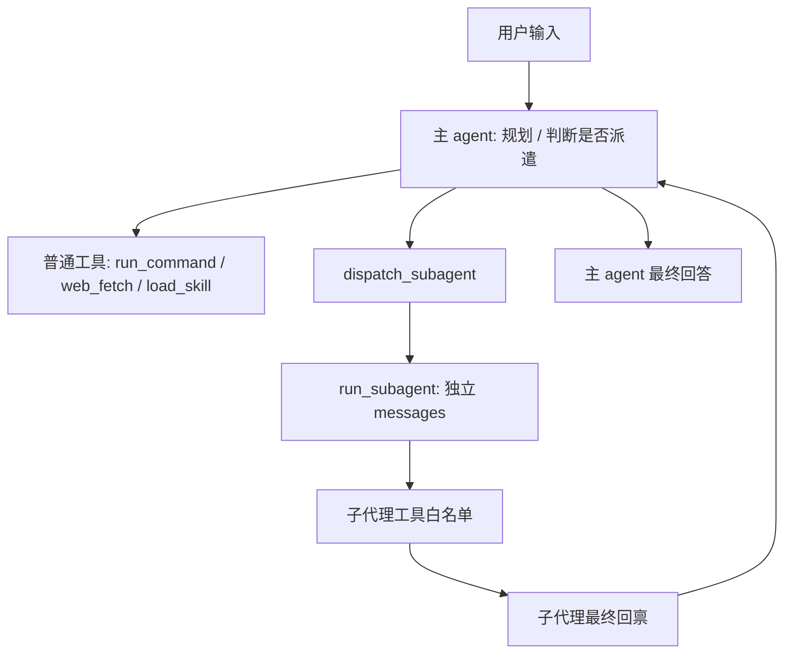

# s08: 子代理 / 上下文隔离 (Subagent)

`s01 > s02 > s03 > s04 | s05 > s06 | s07 > [ s08 ]`

> *"派小太监去办差"* —— 把细节执行外包到独立上下文, 主线只听汇报。
>
> **架构层**: 嵌套循环 + 上下文压缩 + 角色化工具白名单。

## 问题

工具用得越多, 主 history 越脏:

- 一次 `web_fetch` 抓回 8000 字网页;
- 一次 `ls -R` 输出几百行;
- 反复试错的命令日志、粘进来的报错栈。

这些细节对**最终回答**几乎无用, 但会:

1. 占 token, 让对话越来越贵、越来越慢;
2. 稀释模型注意力, 后续推理质量下滑;
3. 触发上下文窗口上限, 早早把对话掐断。

s07 已经让主 agent 会列计划, 但计划里的某些步骤仍然可能产生大量中间输出。s08 要解决的是: **主线负责调度, 细节交给独立子代理执行**。

## 解决方案

把"细节执行"外包给一个**独立的 message loop** (子代理):

- 自己的 messages 列表 (不与主 history 共享);
- 自己的 system prompt (符合宫廷内官职位的人设);
- 自己的工具白名单 (按职位控制权限);
- 工具集**不含** `dispatch_subagent` (防递归) 与 `update_todos` (防状态污染);
- 跑完只把**最终一段文本**作为单条 `tool_result` 回传主 agent。

```
主 agent history:
  ... user ... assistant tool_use(dispatch_subagent) ... tool_result("总结 200 字") ...
                                                                    ▲
                                                                    │  子代理内部跑了 N 轮
                                                                    │  主线只收最终回禀
	   子代理独立上下文 (用完即弃):
	       user(差事) → llm → tool → llm → tool → ... → final_text
	       └────────────── 只这一段回传主 agent ──────────────┘
```

## 代码结构速览

s08 不是只加了一个工具名, 而是把"主线调度"和"细节执行"拆成了几块:

| 代码区域 | 作用 | 为什么需要 |
|----------|------|------------|
| `execute_basic_tool` | 执行基础工具: 命令、网页、技能、读写文件、搜索 | 主 agent 和子代理复用同一套工具执行逻辑 |
| `_TOOL_SCHEMAS` | 统一保存基础工具 schema | 避免主/子两边重复写 schema, 后续改工具只改一处 |
| `SUBAGENT_SPECS` | 配置子代理身份、system prompt、工具白名单、轮次上限 | 把"角色设定"和"权限控制"放到工程配置里 |
| `run_subagent` | 启动一个独立 message loop | 子代理内部可以多轮调用工具, 但只回传最终总结 |
| `dispatch_subagent` | 暴露给主 agent 的派遣工具 | 主 agent 通过 tool_use 把任务交给子代理 |
| `ThreadPoolExecutor` | 并发跑多个子代理 | 多个互不依赖的差事可以同时执行 |

这几个部分形成的职责边界是:



## 子代理身份

这版不再只有一个"通用小太监", 而是预设多种宫廷职位。主 agent 派发时通过 `agent_type` 选择身份, 原则是**权限最窄、职司最贴合**。

| agent_type | 宫廷职位 | 适合任务 | 工具权限 |
|------------|----------|----------|----------|
| `xiaohuangmen` | 通传小黄门 | 短命令、快速确认、跑腿探路 | 只读: `run_command/read_file/glob/grep` |
| `sili_suitang` | 司礼监随堂小太监 | 阅读代码、查文书、整理提纲 | 只读: `load_skill/read_file/glob/grep` |
| `dongchang_tanshi` | 东厂探事小太监 | 抓网页、查资料、探索性搜索 | 只读: `run_command/web_fetch/load_skill/read_file/glob/grep` |
| `shangbao_dianbu` | 尚宝监典簿小太监 | 盘点文件、校对清单、检查遗漏 | 只读: `run_command/read_file/glob/grep` |
| `neiguan_yingzao` | 内官监营造小太监 | 修改文件、搭建工程、跑命令验收 | 可读写: `run_command/web_fetch/load_skill/read_file/write_file/glob/grep` |

`agent_type` 只接受上面这 5 种枚举值。未知身份会在代码里兜底到 `neiguan_yingzao`:

```python
def resolve_subagent_type(agent_type: str) -> str:
    normalized = (agent_type or "neiguan_yingzao").strip()
    if normalized not in SUBAGENT_SPECS:
        return "neiguan_yingzao"
    return normalized
```

## 工作原理

### 1. 公共工具分发函数: 主/子共用

除了 s06 的三件套, 这版还补了文件类工具, 方便不同职位按白名单取用:

```python
def execute_basic_tool(block, prefix=""):
    if block.name == "run_command":
        return subprocess.run(block.input["command"], ...).stdout
    if block.name == "web_fetch":
        return web_fetch(block.input["url"], ...)
    if block.name == "read_file":
        return Path(block.input["path"]).read_text(...)
    if block.name == "write_file":
        Path(block.input["path"]).write_text(...)
```

`prefix="子(东厂探事小太监)·"` 让终端打印能区分主/子上下文, 也能看出是谁在办差。

### 2. 工具 schema 单一来源

主 agent 暴露 `run_command/web_fetch/load_skill`, 子代理也可能使用它们。为了避免两边重复维护, 基础工具 schema 放在 `_TOOL_SCHEMAS`:

```python
_TOOL_SCHEMAS = {
    "run_command": {...},
    "web_fetch": {...},
    "load_skill": {...},
    "read_file": {...},
    "write_file": {...},
    "glob": {...},
    "grep": {...},
}

TOOLS = [
    _TOOL_SCHEMAS["run_command"],
    _TOOL_SCHEMAS["web_fetch"],
    _TOOL_SCHEMAS["load_skill"],
    {...update_todos...},
    {...dispatch_subagent...},
]
```

这样主 agent 和子代理不是各写一套工具描述, 而是从同一个 schema 池里按需取用。

### 3. 角色配置表: prompt 与工具白名单分离

身份写在 `SUBAGENT_SPECS`, 每个职位都有 `title / system_prompt / tools / max_turns`:

```python
SUBAGENT_SPECS = {
    "dongchang_tanshi": {
        "title": "东厂探事小太监",
        "system_prompt": build_subagent_prompt(...),
        "tools": ["run_command", "web_fetch", "load_skill", "read_file", "glob", "grep"],
        "max_turns": 15,
    },
    "neiguan_yingzao": {
        "title": "内官监营造小太监",
        "tools": ["run_command", "web_fetch", "load_skill", "read_file", "write_file", "glob", "grep"],
        "max_turns": 20,
    },
}
```

注意: prompt 只负责人设和职责说明, **真正的权限由 `tools` 白名单决定**。比如司礼监随堂小太监即使想写文件, 也拿不到 `write_file` 工具。

### 4. 子代理函数: 独立 messages, max_turns 上限防跑飞

```python
def run_subagent(task, agent_type="neiguan_yingzao", purpose="", max_turns=None):
    agent_type = resolve_subagent_type(agent_type)
    spec = SUBAGENT_SPECS[agent_type]
    tools = [_TOOL_SCHEMAS[t] for t in spec["tools"]]

    messages = [{"role": "user", "content": task}]
    for _ in range(max_turns or spec["max_turns"]):
        msg = client.messages.create(
            model=MODEL,
            system=spec["system_prompt"],
            tools=tools,
            messages=messages,
        )
        ...
```

关键点有三个:

- `messages = [{"role": "user", "content": task}]`: 子代理从一份干净上下文开始。
- `tools = [_TOOL_SCHEMAS[t] for t in spec["tools"]]`: 不同身份拿到不同工具。
- `for turn in range(...)`: 子代理最多跑固定轮数, 防止内部循环失控。

子代理结束时只返回 `final` 文本。它内部读了多少文件、跑了多少命令, 都不会塞进主 history。

### 5. 主 agent 多一个工具: dispatch_subagent

模型派发时必须传入 `agent_type`, schema 枚举来自:

```python
SUBAGENT_TYPE_OPTIONS = list(SUBAGENT_SPECS.keys())
```

主 prompt 中也写明了身份选择规则:

```text
优先选择权限最窄、职司最贴合的身份:
- xiaohuangmen: 轻量只读
- sili_suitang: 只读文书
- dongchang_tanshi: 只读查访
- shangbao_dianbu: 只读核验
- neiguan_yingzao: 可读写可执行
```

主 agent 看到复杂差事时, 不需要自己把所有工具输出吞进 history, 而是发起:

```python
{
    "name": "dispatch_subagent",
    "input": {
        "task": "阅读 step08_subagent.py, 总结子代理身份和权限边界",
        "agent_type": "sili_suitang",
        "purpose": "梳理子代理身份"
    }
}
```

### 6. 多个子代理可并发派遣

如果同一次模型回复里出现多个 `dispatch_subagent`, 主循环用 `ThreadPoolExecutor` 并发执行:

```python
if len(dispatch_blocks) > 1:
    with ThreadPoolExecutor(max_workers=len(dispatch_blocks)) as pool:
        for block_id, summary in pool.map(_run_one, dispatch_blocks):
            results_map[block_id] = summary
```

最后仍然按原始 tool_use 顺序组装 `tool_results`, 避免并发完成顺序影响 Anthropic API 对 tool_result 的匹配。

这里有一个很重要的教学点: **并发不是主循环自动把任务拆成三份, 而是模型在同一次 assistant 回复里发出了多个 `dispatch_subagent` tool_use**。

比如用户说:

> 分别统计 step01、step02、step03 的代码行数, 再汇总。

模型可能有两种行为:

- 保守模式: 先更新 todolist, 再逐个执行命令。
- 并发模式: 同一次回复里派 3 个 `dispatch_subagent`, 每个子代理负责一个文件。

要提高并发触发概率, 用户可以把意图说得更明确:

> 同时派三个小太监, 分别统计 step01、step02、step03 的代码行数, 最后汇总。

本项目的代码能力已经支持并发; 是否并发触发, 取决于主 agent 在那一轮是否决定一次性发出多个派遣工具调用。

### 7. 可视化上下文压缩

```
[派遣小太监 #1(东厂探事小太监 / dongchang_tanshi)]: 抓 HN 头条
  ┌── subagent context start ──
  [子(东厂探事小太监)·网页获取]: https://news.ycombinator.com
  [子(东厂探事小太监)·内容搜索]: ...
  └── subagent context end (内部 4 轮, 回传 215 字) ──
[小太监回禀]: ...(摘要)...
[主上下文压缩]: 子代理仅向主 history 追加 215 字
```

### 8. 沿用 s07 的收尾闭环

主 agent 的外层 `while` 在 `stop_reason != "tool_use"` 时仍会校验 `TODOS`, 残单回推 + `continue`, 全完则 `TODOS = []` 重置。

子代理工具集**不含** `update_todos`, 所以它无法私改主 todolist; 它的"完成"只是子任务局部完成, 是否真办妥仍由主 agent 在收尾时校验。

## 一次派遣的完整执行链路

以"阅读一个代码文件并总结"为例:

1. 用户交办: `阅读 step08_subagent.py, 总结子代理怎么实现`
2. 主 agent 判断这是细节阅读任务, 选择 `sili_suitang`
3. 主 agent 发出 `dispatch_subagent`
4. 主循环把该 tool_use 分流到 `run_subagent`
5. 子代理拿到自己的 system prompt 和只读工具白名单
6. 子代理调用 `read_file/grep` 等工具阅读代码
7. 子代理产出一段总结文本
8. 主循环把总结包装成 `tool_result`
9. 主 agent 基于这段总结回答用户

这个过程的收益是: 主 agent 不需要保存完整源码、命令日志、搜索结果, 只需要保存"子代理办完后回禀的一段话"。

## 工程化取舍

- **权限白名单比 prompt 更可靠**: prompt 可以提醒"不要写文件", 但真正防写入的是不给 `write_file`。
- **子代理不能再派子代理**: 子代理工具里没有 `dispatch_subagent`, 防止递归套娃。
- **子代理不能改主计划**: 子代理工具里没有 `update_todos`, 防止局部任务污染全局 todolist。
- **主/子工具 schema 复用**: `_TOOL_SCHEMAS` 是单一来源, 减少重复配置。
- **并发后按原顺序回填结果**: 工具可以并发跑, 但回传给 Anthropic 的 `tool_result` 仍按原始 tool_use 顺序组装。
- **角色只是认知包装, 权限才是边界**: "小黄门/东厂/内官监"方便记忆, 但系统真正执行的是工具白名单。

完整代码: [code/step08_subagent.py](../code/step08_subagent.py)

## 变更内容

| 组件 | 之前 (s07) | 之后 (s08) |
|------|------------|------------|
| 工具数 | 4 | 5 (新增 `dispatch_subagent`) |
| 上下文模型 | 单一 history | 主 + 子隔离 |
| 子代理身份 | 无 | 5 种宫廷职位预设 |
| 工具分发 | 重复 if/elif | 抽出 `execute_basic_tool` 共用 |
| 子代理权限 | 无分层 | 按职位配置工具白名单 |
| 并发能力 | 无 | 多个 `dispatch_subagent` 可并发执行 |
| 防御机制 | 单 in_progress + 残单回推 | + `max_turns` 限流 + 无递归 + 无私改 todo |
| 终端打印 | 单层 | 双层缩进, 显示职位与 context start/end |
| 收尾闭环 | 已具备 (校验 + 重置) | 沿用; 子代理只回传局部结果 |

## 试一试

```sh
python build-agent-example/code/step08_subagent.py
```

- `派通传小黄门去 ls -1 build-agent-example/code/, 把文件名整理成一句话回报朕`
- `派司礼监随堂小太监阅读 build-agent-example/code/step08_subagent.py, 总结子代理身份有哪些`
- `派东厂探事小太监去抓 https://example.com 和 https://example.org, 给朕一句话总结两站差异`
- `派尚宝监典簿小太监清点 build-agent-example/code 下每个 step 文件, 看是否从 01 到 08 连续`
- `朕要修改一个 demo 文件 -- 派内官监营造小太监去创建 tmp/demo.txt, 写入一句话后回报`

观察 `[派遣小太监 #N(职位 / agent_type)] ... [小太监回禀] ... [主上下文压缩]: X 字` —— 子代理跑了多少轮工具调用, 主 history 都只多 1 条结果。

教学闭环完成: s05 让 agent 能动手, s07 让它会规划, s08 让它能按职位委派。
